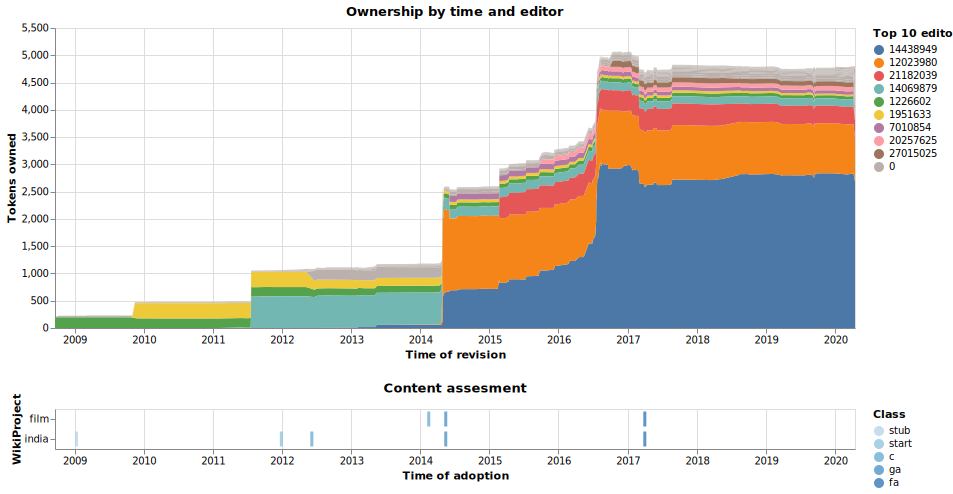
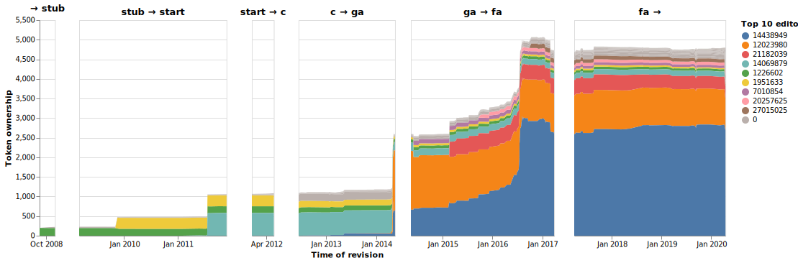
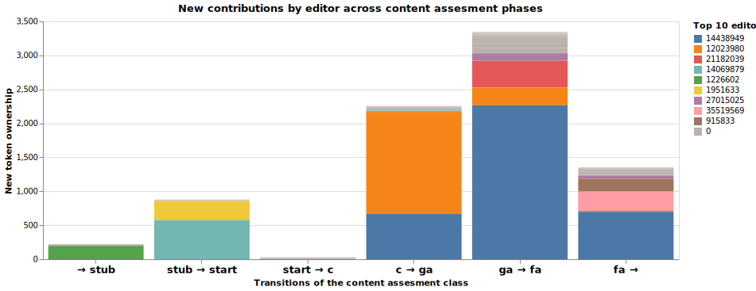

# Wikipedia Curriculum Vitae

**Intentions:** Reward people who write Wikipedia with a pretty résumé. Not just any résumé. But a résumé that easily communicates to people outside the Wikipedia community, and a résumé that does more than count edits. Naturally, the résumés will be generated automatically and kept up to date. 

[Further inspiration and additional resources](https://pinboard.in/u:bonna/t:project-wiki-cv)

### Early exploration

**A stable CV without compromising content quality**  
Wikipedia articles constantly evolve, while a résumé – traditionally – acts as a record of past achievements. Most would agree that your big achievement from 3 years ago is not invalid if someone else later improves upon it. Capturing some sort of stability in the résumé is therefore worth attempting, however this should not be at the expense of content quality. While it is easy for anyone to edit articles on Wikipedia, this feature also makes it easy for anyone ill-intentioned to inflate his or her edits (e.g. through low quality, high frequency, repetitive edits). The résumé should avoid rewarding such behaviour. 

To this end, two concepts seem promising; The first is the use of the [quality assessments by members of WikiProjects](https://en.wikipedia.org/wiki/Wikipedia:Content_assessment). These content assessments provide an anchor in time (i.e. stability) and community validation of quality. Specifically, the assessments result in one of the following grades (ranked worst to best): _Stub_, _Start_, _C-class_, _B-class_, _A-class_, _Good Article_, _Feature Article_. The [articlequality](https://github.com/wikimedia/articlequality) library can detect and extract the historic content assessment classes from  [talk page revisions](https://en.wikipedia.org/wiki/Help:Talk_pages). The second concept is the use of [token-level provenance by the WikiWho algorithm](https://github.com/wikiwho/WikiWho). Broadly speaking, for each token/word in a Wikipedia article the algorithm identifies the original editor that added it. Below follow some figures from a quick exploration that combines these two concepts.

The **[jupyter notebook](Exploration.ipynb) with code and details is available**. This notebook builds upon an earlier notebook in the [WikiWho demo](https://github.com/gesiscss/wikiwho_demo_new) repository.

The figures below explore the editing history of the Wikipedia article [Andha Naal](https://en.wikipedia.org/wiki/Andha_Naal) (a 1954 Indian mystery-thriller film).

The article constantly evolves, growing in size from a few hundred words in 2009 to several thousand in 2020. At each point in time, the top panel in the figure above shows the number of tokens/words and the editor with whom these tokens originated, i.e. the token ownership as it evolves over time. A few editors contribute a large majority of the content expanding the article in bursts of new tokens. The bottom panel in the figure above shows when the different content assessment classes were adopted (also available in the table below).

page_title|project|timestamp|class
|:--|:--|:--|:--|
Andha Naal|india|2009-01-11 05:49:17|stub
 |india|2011-12-29 06:17:08|start
 |india|2012-06-07 09:28:04|c
 |film|2014-02-14 19:41:38|c
 |india|2014-05-15 17:06:28|ga
 |film|2014-05-15 17:06:28|ga
 |film|2017-03-31 23:09:24|fa
 |india|2017-03-31 23:09:24|fa

These content assessments are (external) validations of the quality. While the validation mechanism is not foolproof,  assessments often come from people that have not themselves edited the contents of the article. It therefore complements the more continuous evaluation provided by _token ownership_, which captures quality in the form of tokens surviving multiple edits and the test of time. 

Additionally, the content assessments provide an anchor in time. That is, every time an article is awarded a better grade it is an opportunity to "freeze" part of the editors' résumé, thus providing stability. If you in 2014, lifted the _Andha Naal_ article from a _C-class_ to a _Good Article_ grade, then that achievement will be part of your résumé, and stay part of your résumé also once other editors improve the article further. To emphasise this, the figure below splits the token ownership history into phases, each corresponding to a transition from one content assessment class to another class – a better class. The first phase covers the period until the article was designated a _Stub_ and the last phase covers the period from _Feature Article_ until the latest revision.

Focusing on the transitions of classes opens several avenues, but below I present just one; the new tokens/words added within each transition by each editor, i.e. each editor's contribution  to each of the staged improvements of the article. Again, the first stacked bar covers the period until the article was designated a _Stub_ and the last bar covers the period from _Feature Article_ until the latest revision.

Comparing the first figure with the last, we see how it is possible to decompress the vast amount of information down into just a few relevant numbers that capture the essential quality improvements and the editors responsible for these improvements. These numbers might then be included (in some form or another) on the résumé of any of the top editors. Perhaps résumé will include summaries like:

* _"Editor X was one of two main editors responsible for the **Andha Naal** article earning a **Good Article** grade, up from a C-class grade."_
* _"Editor Y was the main editor helping the **Andha Naal** article pass external in-depth validation that earned it the **Feature Article** grade after having received the Good Article grade three years earlier."_

