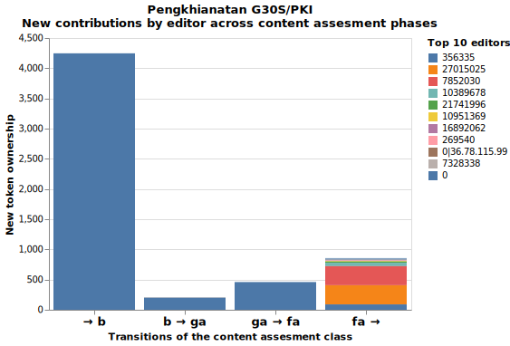
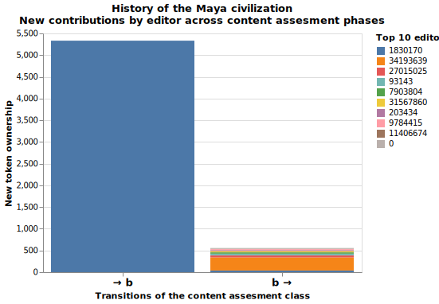
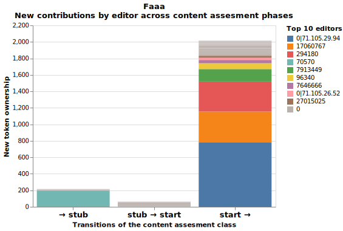
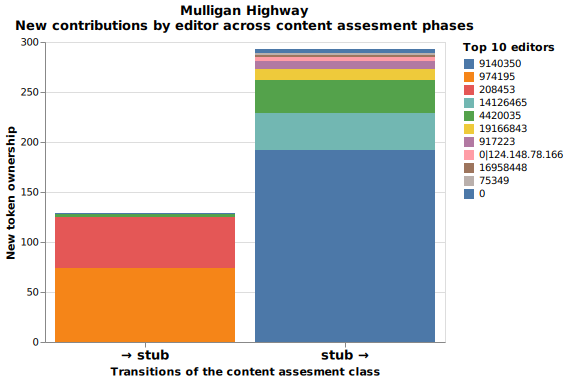
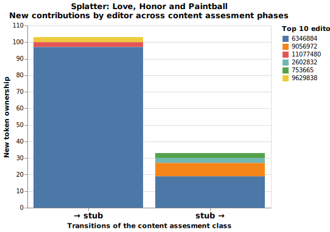
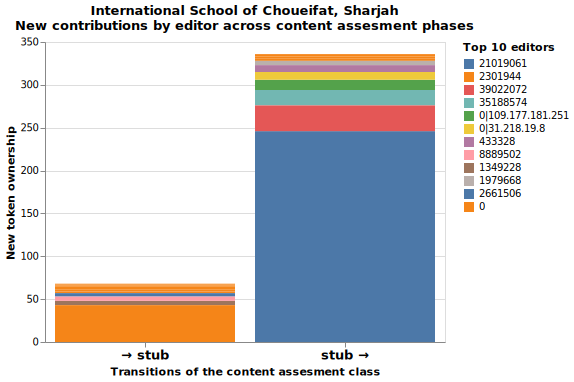

# Exploration of random sample of Wikipedia articles

The figures below explore the editing history of different randomly sampled Wikipedia articles. Specifically, we pick 5 random articles for each grade (i.e. _Stub_, _Start_, _C-class_, _B-class_, _A-class_, _Good Article_, _Feature Article_). See [explaination](README.md) of figure. Or [jupyter notebook](Exploration_sample.ipynb) with code.

| ... | ... |
|:--|:--|
| **Feature Article** |  |
|  |  |
|  |  |
| **Good article** |  |
|  |  |
|  |  |
| **A-class** |  |
|  |  |
|  |  |
| **B-class** |  |
|  |  |
|  |  |
| **C-class** |  |
|  |  |
|  |  |
| **Start** |  |
|  |  |
|  |  |
| **Stub** |  |
|  |  |
|  |  |
